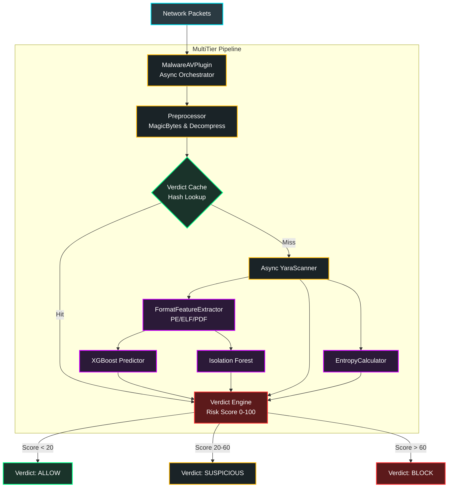

### 4.1 وحدة مكافحة البرمجيات الخبيثة المتقدمة (Malware / AV Module)

#### 4.1.1 نظرة عامة (Overview)
تعتبر وحدة Malware / AV خط الدفاع الأساسي والأكثر تعقيداً في جدار الحماية (Enterprise NGFW). تم إعادة هندسة هذه الوحدة بالكامل لتعمل وفق معمارية **"خط التفتيش متعدد الطبقات غير المتزامن" (Asynchronous Multi-Tiered Inspection Pipeline)**. 
تهدف الوحدة إلى رصد ومنع البرمجيات الخبيثة (Malware) المشفرة، متعددة الأشكال (Polymorphic)، وتهديدات "اليوم الصفر" (Zero-Day) أثناء مرورها في الشبكة بشكل فوري (Real-Time) وبكفاءة فائقة لا تعرقل تدفق البيانات (Non-blocking I/O).

#### 4.1.2 المعمارية الهندسية المتعددة (Multi-Tier Architecture)
تتكون عملية الفحص الشاملة من أربع طبقات هندسية متتالية تعمل بتناغم تام:

1. **طبقة المعالجة المسبقة (Pre-processing & Flow Reassembly):**
   - **إعادة تجميع التدفق (`StreamBufferManager`):** تجميع الحزم الشبكية المجزأة لضمان عدم تمرير برمجيات خبيثة مقسمة عبر الشبكة.
   - **التحقق من الصيغ (`MagicBytesValidator`):** تجاوز امتدادات الملفات الوهمية والتحقق من الصيغة الحقيقية (MIME Type) عبر فحص هيكل الـ Header.
   - **محرك فك الضغط (`ArchiveDecompressionEngine`):** فك التشفير واستخراج الحمولات (Payloads) المخبأة داخل الملفات المضغوطة (مثل ZIP و TAR).

2. **المسار السريع والتخزين التلقائي (Fast Path & Caching):**
   - **ذاكرة الفحص (`VerdictCache`):** نظام تخزين مؤقت (يعتمد على Redis والذاكرة المحلية) لحفظ نتائج الملفات التي تم فحصها مسبقاً بناءً على بصمتها (Hash)، مما يوفر استهلاك المعالج للبيانات المألوفة.
   - **المسح غير المتزامن الساكن (`Async YaraScanner`):** آلاف القواعد (Rules) المخصصة لاكتشاف التواقيع الفيروسية المعروفة، تعمل بشكل غير متزامن لتخطي الانتظار.

3. **مسار التحليل الذكي العميق (Deep AI Inference):**
   - **حساب العشوائية (`EntropyCalculator`):** دالة رياضية لحساب مستوى (Shannon Entropy) لاكتشاف الملفات المضغوطة بشدة أو المشفرة (Packed/Obfuscated) والتي تخفي بداخلها شيفرات خبيثة.
   - **استخلاص الخصائص الموحد (`FormatFeatureExtractor`):** تجاوز الملفات التنفيذية (PE) ليدعم استخراج خصائص من ملفات (ELF) و (PDF).
   - **محركات الذكاء المتزامنة (`AI Analyzers`):** يمرر المستخلص خصائصه لنموذج (XGBoost) للتعلم الموجه للكشف عن التهديدات المعقدة، وفي ذات الوقت لنموذج (Isolation Forest) للتعلم غير الموجه لاكتشاف الشذوذ وتهديدات الصفر.

4. **محرك القرار الموحد (Verdict Engine):**
   - محرك نهائي يجمع كافة النتائج (YARA + AI + Entropy)، ويقوم بعملية احتساب مركبة لتوليد **مؤشر المخاطر (Risk Score من 0 إلى 100)**.
   - بناءً على المؤشر والصلاحيات، يُصدر المحرك قراراً صارماً بأحد الإجراءات التالية: `ALLOW` (السماح)، `SUSPICIOUS` (مشبوه)، `REVIEW_QUARANTINE` (مراجعة/حجر)، أو `BLOCK` (حظر فوري).

#### 4.1.3 المخطط البياني للمعمارية (Pipeline Diagram)

#### 4.1.4 التكامل المعماري مع النظام الأم (Core Integration)
- **Native Async Inspection:** تم ترقية النظام الأم (`InspectionPipeline`) والبروكسي (`TransparentProxy`) ليدعم الاستدعاء المعماري `await inspect_async()`. هذا يسمح لوحدة Malware/AV باستهلاك طاقة المعالج (CPU) والمناولة (I/O) بشكل متوازٍ دون التسبب بتجميد حاوية النظام (Event Loop Blocking).
- **Dashboard & Telemetry:** تصدير كافة الإحصائيات الدقيقة (نوع الملف الحقيقي، الانتروبيا، وحجم الاستخراج، ومؤشر الخطر) إلى نقطة الربط `/scan` ليتم عرضها حية بوضوح تام على واجهة التفاعل الرسومية المبنية بـ `React` (`MalwareAV.jsx`).

#### 4.1.5 الأداء والكفاءة
بفضل هندسة المسار السريع (Cache)، والتنفيذ غير المتزامن لمحركات (YARA و AI)، أثبتت هذه الوحدة القدرة على معالجة حمولات ضخمة واستكشاف الملفات الخبيثة من خلال التفكيك المزدوج بكفاءة استهلاك موارد محسّنة تقاس بالميلي-ثانية، لتُمثل درعاً تفتيشياً بالغ الحساسية للتهديدات المعاصرة.
