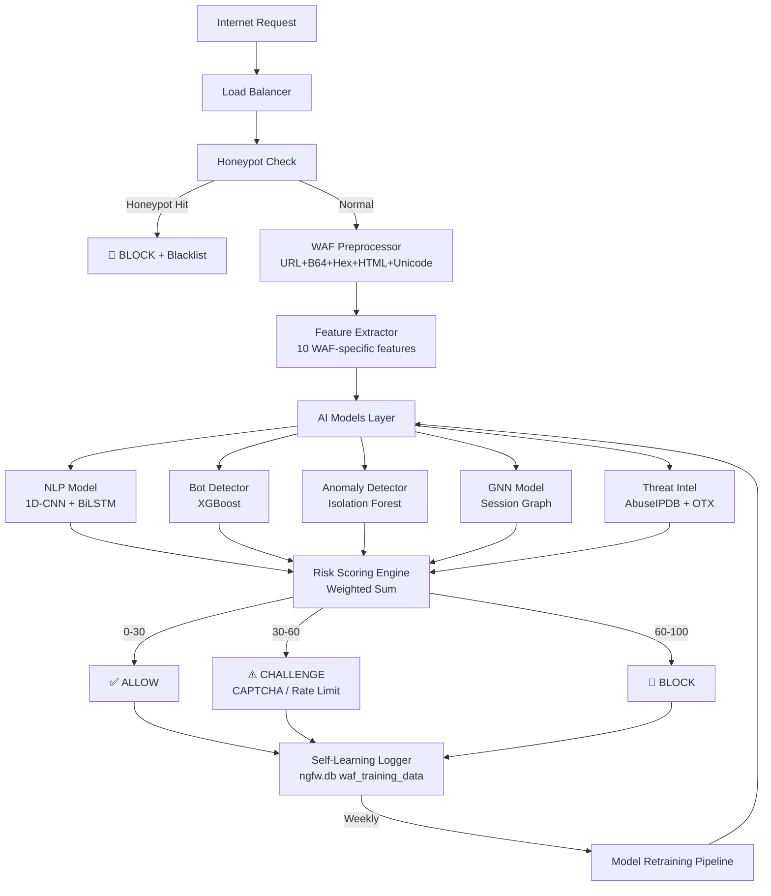

# دراسة تطوير: AI-Powered WAF Architecture
## Enterprise NGFW — المنطلق: [waf_inspector.py](file:///m:/%D9%86%D8%B3%D8%AE%20%D8%A7%D9%84%D9%85%D8%B4%D8%B1%D9%88%D8%B9/enterprise_ngfw/inspection/plugins/waf_inspector.py)

---

## الوضع الحالي (Baseline Analysis)

### ما يمتلكه [waf_inspector.py](file:///m:/%D9%86%D8%B3%D8%AE%20%D8%A7%D9%84%D9%85%D8%B4%D8%B1%D9%88%D8%B9/enterprise_ngfw/inspection/plugins/waf_inspector.py) الآن

| المكوّن | الحالة |
|---|---|
| URL Decoding (طبقة واحدة) | ✅ موجود |
| Regex-based Rules (SQLi, XSS, LFI, CMDi) | ✅ موجود |
| Block / Allow فقط (بدون درجة خطر) | ✅ موجود |
| ربط بـ [InspectorPlugin](file:///m:/%D9%86%D8%B3%D8%AE%20%D8%A7%D9%84%D9%85%D8%B4%D8%B1%D9%88%D8%B9/enterprise_ngfw/inspection/plugins/waf_inspector.py#24-109) framework | ✅ موجود |
| AI / ML | ❌ غائب |
| Multi-layer Decoding (Base64, Hex, Unicode…) | ❌ غائب |
| Risk Scoring | ❌ غائب |
| Bot Detection | ❌ غائب |
| Behavioral Analysis | ❌ غائب |
| Threat Intelligence | ❌ غائب |
| Honeypot | ❌ غائب |
| Self-Learning | ❌ غائب |

### ما يمتلكه النظام المحيط (نقاط الربط)

يتضمن المشروع بالفعل بنية تحتية متقدمة يمكن الاستفادة منها:

- **[ml/inference/deep_learning.py](file:///m:/%D9%86%D8%B3%D8%AE%20%D8%A7%D9%84%D9%85%D8%B4%D8%B1%D9%88%D8%B9/enterprise_ngfw/ml/inference/deep_learning.py)** — `DeepTrafficClassifier` مع `ThreatCategory`
- **[ml/inference/anomaly_detector.py](file:///m:/%D9%86%D8%B3%D8%AE%20%D8%A7%D9%84%D9%85%D8%B4%D8%B1%D9%88%D8%B9/enterprise_ngfw/ml/inference/anomaly_detector.py)** — Isolation Forest-based anomaly detection
- **[ml/inference/adaptive_policy.py](file:///m:/%D9%86%D8%B3%D8%AE%20%D8%A7%D9%84%D9%85%D8%B4%D8%B1%D9%88%D8%B9/enterprise_ngfw/ml/inference/adaptive_policy.py)** — محرك القرارات الديناميكي
- **[ml/inference/reinforcement_learning.py](file:///m:/%D9%86%D8%B3%D8%AE%20%D8%A7%D9%84%D9%85%D8%B4%D8%B1%D9%88%D8%B9/enterprise_ngfw/ml/inference/reinforcement_learning.py)** — RL-based policy optimizer
- **[inspection/plugins/ai_inspector.py](file:///m:/%D9%86%D8%B3%D8%AE%20%D8%A7%D9%84%D9%85%D8%B4%D8%B1%D9%88%D8%B9/enterprise_ngfw/inspection/plugins/ai_inspector.py)** — 21-feature AI inspector مرتبط بـ FlowTracker
- **[inspection/framework/pipeline.py](file:///m:/%D9%86%D8%B3%D8%AE%20%D8%A7%D9%84%D9%85%D8%B4%D8%B1%D9%88%D8%B9/enterprise_ngfw/inspection/framework/pipeline.py)** — pipeline يدعم plugins متعددة بالتسلسل
- **[inspection/framework/plugin_base.py](file:///m:/%D9%86%D8%B3%D8%AE%20%D8%A7%D9%84%D9%85%D8%B4%D8%B1%D9%88%D8%B9/enterprise_ngfw/inspection/framework/plugin_base.py)** — [InspectorPlugin](file:///m:/%D9%86%D8%B3%D8%AE%20%D8%A7%D9%84%D9%85%D8%B4%D8%B1%D9%88%D8%B9/enterprise_ngfw/inspection/plugins/waf_inspector.py#24-109) base class مع `InspectionResult`

> **الفرصة الذهبية**: النظام يدعم بالفعل pipeline من plugins. يمكن بناء WAF الذكي كـ **plugin مستقل** يتكامل مع البنية القائمة دون كسر أي شيء.

---

## الفجوات الحرجة وأخطر نقاط الضعف

### أخطر 12 تقنية تجاوز WAF يجب التصدي لها

| # | تقنية الهجوم | سبب نجاحها على [waf_inspector.py](file:///m:/%D9%86%D8%B3%D8%AE%20%D8%A7%D9%84%D9%85%D8%B4%D8%B1%D9%88%D8%B9/enterprise_ngfw/inspection/plugins/waf_inspector.py) الحالي |
|---|---|---|
| 1 | **HTTP Parameter Pollution (HPP)** | يقرأ فقط `data` كـ bytes خام دون تحليل HTTP params |
| 2 | **Polyglot Payloads** | pattern واحد لكل نوع هجوم — يفشل مع الهجمات المدمجة |
| 3 | **Encoding Chains** (UTF-8 → Hex → Base64) | يفك URL encoding فقط — طبقة واحدة |
| 4 | **HTTP Method Tunneling** | لا يتحقق من HTTP method vs payload |
| 5 | **Chunked Transfer Encoding** | يفحص `data` كاملة کـ blob دون re-assembly |
| 6 | **SQL Comment Obfuscation** (`UNION/**/SELECT`) | الـ regex لا يتجاهل comments داخل السطر |
| 7 | **Case Variation** (`sElEcT * FrOm`) | الـ flags هي [(?i)](file:///m:/%D9%86%D8%B3%D8%AE%20%D8%A7%D9%84%D9%85%D8%B4%D8%B1%D9%88%D8%B9/enterprise_ngfw/inspection/plugins/waf_inspector.py#78-109) — هذا **موجود** بالفعل ✅ |
| 8 | **Nested JSON/XML Injection** | لا يوجد JSON/XML parser |
| 9 | **URL Path Traversal with Encodings** | يفك URL مرة واحدة فقط |
| 10 | **HTTP Header Injection** | لا يفحص headers |
| 11 | **Rate-Limiting Evasion** (distributed) | لا يوجد rate tracking |
| 12 | **Session Fixation/Hijacking** | لا يوجد session tracking |

---

## خطة التطوير المرحلية (10 طبقات)

---

## 🔴 المرحلة 1 — Preprocessing Engine (الأعلى أولوية)

### الفجوة
[waf_inspector.py](file:///m:/%D9%86%D8%B3%D8%AE%20%D8%A7%D9%84%D9%85%D8%B4%D8%B1%D9%88%D8%B9/enterprise_ngfw/inspection/plugins/waf_inspector.py) يفك URL encoding مرة واحدة فقط. أغلب الهجمات الحديثة تستخدم **Encoding Chains** متعددة الطبقات.

### الطلب: `waf_preprocessing.py`

```python
# inspection/plugins/waf/preprocessing.py
class WAFPreprocessor:
    """Multi-layer decoder to neutralize obfuscation before AI analysis"""
    
    MAX_ITERATIONS = 5  # منع infinite loop في حالة التشفير المتكرر
    
    def decode(self, raw: bytes) -> str:
        """
        Pipeline: URL → Base64 → Hex → HTML Entity → Unicode Normalize → Strip Comments
        يُطبَّق بشكل متكرر حتى يستقر الناتج
        """
        text = raw.decode('utf-8', errors='replace')
        for _ in range(self.MAX_ITERATIONS):
            prev = text
            text = self._url_decode(text)
            text = self._base64_detect_and_decode(text)
            text = self._hex_decode(text)
            text = self._html_entity_decode(text)
            text = self._unicode_normalize(text)
            text = self._strip_comments(text)
            if text == prev:
                break  # استقر — لا يوجد مزيد من الطبقات
        return text
```

### يعالج من الـ 12 Bypass
✅ Encoding Chains (#3) | ✅ URL Path Traversal with Encodings (#9) | جزئياً HPP (#1)

---

## 🟠 المرحلة 2 — Feature Extractor للـ WAF

### الفجوة
النماذج تحتاج أرقاماً، وليس نصوصاً. [ai_inspector.py](file:///m:/%D9%86%D8%B3%D8%AE%20%D8%A7%D9%84%D9%85%D8%B4%D8%B1%D9%88%D8%B9/enterprise_ngfw/inspection/plugins/ai_inspector.py) يستخرج features شبكية (pps, bps…) لكن لا توجد features خاصة بـ HTTP payload.

### Features خاصة بالـ WAF

| Feature | ماذا يقيس | كيف يُحسب |
|---|---|---|
| `request_length` | طول الطلب الكلي | `len(decoded_payload)` |
| `payload_entropy` | عشوائية النص (تشفير؟) | Shannon entropy / 8.0 |
| `special_char_ratio` | نسبة الرموز الخطرة | `count(';','"','<','>'…) / len` |
| `keyword_count` | عدد كلمات هجوم معروفة | قاموس SQLi/XSS keywords |
| `parameter_count` | عد المتغيرات | `len(parse_qs(query_string))` |
| `encoding_layers` | كم طبقة تشفير وُجدت | عداد داخل `WAFPreprocessor` |
| `sql_comment_density` | كثافة `/**/` و `--` | regex count / len |
| `path_depth` | عمق مسار URL | `url.count('/')` |
| `has_null_byte` | وجود null byte (بايباس شائع) | `b'\x00' in data` |
| `header_anomaly_score` | غرابة الـ headers | مقارنة مع baseline |

### الربط بالنظام الحالي
يُضاف هذا الـ `WafFeatureExtractor` ليُغذّي نفس النماذج الموجودة في `ml/inference/`.

---

## 🟠 المرحلة 3 — NLP Attack Detection Model

### الفجوة
النماذج الحالية تحلل **حركة الشبكة** وليس **محتوى HTTP**. يجب نموذج NLP مخصص للـ payloads.

### المعمارية المقترحة: `1D-CNN + BiLSTM`

```
HTTP Payload (decoded text)
        │
  Tokenizer (char-level)
        │
  1D-CNN (Extract local patterns)    ← يكتشف: UNION, <script>, ../../
        │
  BiLSTM (Understand sequence)       ← يكتشف: تسلسل الهجوم
        │
  Dense + Sigmoid
        │
  Attack Probability [0.0 → 1.0]
```

**لماذا Char-level وليس Word-level؟**
لأن المهاجمين يشوهون الكلمات (`UN/**/IO/**/N`, `%55NION`). على مستوى الحرف، الناتج بعد Preprocessing سيكون قابلاً للتعرف عليه.

### Dataset للتدريب

| Dataset | الحجم | الاستخدام |
|---|---|---|
| **Kaggle Malicious URLs Dataset** | ~650K URL | تدريب URL classifier |
| **CSIC 2010 HTTP Dataset** | ~36K requests | SQLi/XSS/LFI تدريب |
| **OWASP CRS Rules → Synthetic** | توليد | توليد بيانات هجومية |
| **Enron (للـ phishing)** | ~500K emails | خط ثانوي لـ phishing في HTTP |

### مسار الملفات المقترح
```
ml/training/waf_nlp/
├── train.py
├── model.py          # 1D-CNN + BiLSTM
├── tokenizer.py      # Char-level tokenizer
├── datasets/
│   ├── malicious_urls.csv    # Kaggle
│   └── csic_http.csv
└── waf_nlp_model.pkl
```

---

## 🟡 المرحلة 4 — Bot Detection Model

### الفجوة
80% من هجمات الويب تأتي من Bots. لا يوجد أي bot detection في النظام الحالي.

### Features المطلوبة لـ Bot Detection

**Network-level (متوفرة بالفعل عبر `FlowTracker`):**
- `request_rate` — طلبات/ثانية
- `iat_variance` — تباين الزمن بين الطلبات (البوت منتظم)
- `session_duration` — مدة الجلسة
- `unique_endpoints_ratio` — نسبة endpoints مختلفة/إجمالي

**HTTP-level (جديدة):**
- `user_agent_entropy` — User-Agent عشوائي؟
- `header_order_hash` — ترتيب الـ headers (لكل browser بصمة)
- `accept_language_valid` — هل اللغة منطقية؟
- `cookie_consistency` — هل الـ cookies تتطور بشكل طبيعي؟
- `referer_chain_valid` — هل مسار التصفح منطقي؟

### النموذج المقترح: `XGBoost`

**لماذا XGBoost؟**
- سريع جداً في الـ inference (< 1ms)
- يتعامل مع categorical و numerical features بشكل ممتاز
- قابل للتفسير (Feature importance)

```python
# ml/training/bot_detection/
# Gradient Boosted Trees
# Classes: [legit_user, headless_browser, scraper, vulnerability_scanner]
```

---

## 🟡 المرحلة 5 — Graph Neural Network (GNN)

### الفجوة
الهجمات **الموزعة والتدريجية** (مثل lateral movement وaccount takeover) لا تظهر في طلب واحد — تظهر فقط عند تحليل تسلسل الطلبات.

### الفكرة: تحويل Session إلى Graph

```
IP_192.168.1.1
    │
    ├─── /login (POST) ──→ ✅ نجح
    │
    ├─── /api/users ──→ 403 (رفض)
    │
    ├─── /admin ──→ 404
    │
    └─── /api/users?id=1 ──→ ✅ نجح  ← sequential probing pattern
```

GNN يرى هذا الـ Graph كاملاً ويكتشف:
- **API Abuse**: طلبات متعددة لنفس الـ API endpoint
- **Lateral Movement**: التنقل بين resources المختلفة بشكل غير طبيعي
- **Distributed Attacks**: نفس النمط من IPs مختلفة

### البيانات المطلوبة
- Session logs مع sequence من الطلبات
- توليد synthetic graphs من CSIC dataset

### الربط بالنظام الحالي
```python
# الـ FlowTracker موجود بالفعل ويتتبع flows
# يحتاج إضافة: SessionGraph builder يجمع flows من نفس IP/session
```

### ملاحظة أولوية
GNN هو **الأصعب تنفيذاً** — يُوصى بتأجيله للمرحلة الأخيرة وتنفيذه بعد نجاح باقي النماذج.

---

## 🟢 المرحلة 6 — Risk Scoring Engine

### الفجوة الحرجة
`waf_inspector.py` الحالي: إما BLOCK أو ALLOW — **لا يوجد وسط**.
هذا يسبب:
- **False Positives**: حجب مستخدمين شرعيين
- **False Negatives**: السماح بهجمات منخفضة الثقة

### نظام الدرجات المقترح

```python
risk_score = (
    nlp_score     * 0.35 +   # NLP Attack Detection
    anomaly_score * 0.25 +   # Behavioral Anomaly
    bot_score     * 0.20 +   # Bot Detection
    reputation    * 0.15 +   # Threat Intelligence
    honeypot_flag * 0.05      # Honeypot trigger
)
```

| الدرجة | القرار | الإجراء |
|---|---|---|
| 0 – 30 | ALLOW | تمرير مع تسجيل |
| 30 – 60 | CHALLENGE | CAPTCHA / تحديد معدل |
| 60 – 80 | SOFT BLOCK | 429 Too Many Requests |
| 80 – 100 | BLOCK | 403 Forbidden + IP ban |

### الربط بالنظام الحالي
```python
# InspectionResult الحالية تحتوي: action + findings + metadata
# نضيف: risk_score في metadata
result.metadata['risk_score'] = risk_score
result.metadata['risk_breakdown'] = {
    'nlp': nlp_score,
    'anomaly': anomaly_score,
    'bot': bot_score,
    'reputation': reputation_score,
}
```

---

## 🟢 المرحلة 7 — Threat Intelligence Integration

### المصادر المقترحة

| المصدر | ماذا يوفر | API |
|---|---|---|
| **AbuseIPDB** | IP reputation + report count | REST API, 1000 req/day مجاناً |
| **Spamhaus** | Botnet C&C, spam IPs | DNS-based lookup |
| **AlienVault OTX** | Full Threat Intel (IP, domain, hash) | REST API مجاني |
| **Feodo Tracker** | Botnet C2 IPs | CSV download |

### طريقة التكامل

```python
# core/threat_intel.py (جديد)
class ThreatIntelCache:
    """
    Local Redis/SQLite cache للـ IP reputations
    TTL: 6 ساعات لتجنب الاستدعاء المتكرر
    يُحدَّث في background thread كل ساعة
    """
    async def get_ip_score(self, ip: str) -> float:
        """0.0 = نظيف, 1.0 = خطير جداً"""
```

### الربط بالنظام الحالي
```python
# في ai_inspector.py الحالي:
# reputation = float(context.metadata.get('reputation_score', 100.0))
# نُغذّي هذا الـ metadata من ThreatIntelCache
```

---

## 🔵 المرحلة 8 — Honeypot Layer

### الفكرة
إضافة endpoints وهمية في middleware. المستخدم الطبيعي لن يصلها أبداً.

```python
HONEYPOT_PATHS = {
    '/admin_backup',
    '/.env',
    '/debug_console',
    '/private_api',
    '/wp-admin',        # WordPress (حتى لو الموقع ليس WP)
    '/phpmyadmin',
    '/.git/config',
    '/api/v0/internal',
}
```

### عند الوصول إلى Honeypot
```python
if request.path in HONEYPOT_PATHS:
    # 1. تسجيل IP فوراً
    # 2. رفع Risk Score بـ +50 نقطة
    # 3. إضافة لـ blacklist مؤقت (24 ساعة)
    # 4. إرجاع 404 (لا نكشف أنه Honeypot)
    return fake_404_response()
```

### الربط بالنظام الحالي
يُضاف كـ middleware قبل `InspectionPipeline` أو كـ WAF rule بأعلى priority.

---

## 🔵 المرحلة 9 — Self-Learning Engine

### الفكرة: Feedback Loop

```
Request
   │
WAF Decision (Allow/Challenge/Block)
   │
   ├── Security Admin يؤكد: "هذا هجوم حقيقي" ── ► إضافة لـ Dataset (label=1)
   │
   └── False Positive اكتُشف ── ► إضافة لـ Dataset (label=0)
   
كل أسبوع:
   - إعادة تدريب NLP Model على البيانات الجديدة
   - تحديث Feature weights في Risk Scoring
```

### بنية التخزين

```python
# في ngfw.db (SQLite الموجود بالفعل)
# جدول جديد:
CREATE TABLE waf_training_data (
    id INTEGER PRIMARY KEY,
    timestamp DATETIME,
    payload TEXT,           -- النص بعد Preprocessing
    features JSON,          -- الـ WAF features المستخرجة
    label INTEGER,          -- 0=benign, 1=attack, 2=suspicious
    source TEXT,            -- 'auto_block' | 'admin_confirmed' | 'fp_corrected'
    model_version TEXT      -- أي نسخة نموذج اتخذت القرار
);
```

---

## 🔵 المرحلة 10 — WAF Autopilot (المرحلة النهائية)

### الفكرة
بعد اكتمال Self-Learning، يمكن للنظام:
1. **توليد WAF rules تلقائياً** بناءً على الأنماط المكتشفة
2. **Adaptive Rate Limiting**: تعديل الحد بناءً على سلوك IP
3. **API Schema Validation**: رفض أي طلب لا يتطابق مع schema المتعلَّم

---

## معمارية النظام الكاملة



---

## خطة ربط الكود بالمشروع الحالي

### الملفات الجديدة المقترحة

```
inspection/plugins/waf/
├── __init__.py
├── preprocessor.py          # WAFPreprocessor (المرحلة 1)
├── feature_extractor.py     # WafFeatureExtractor (المرحلة 2)
├── honeypot.py              # HoneypotMiddleware (المرحلة 8)
└── risk_engine.py           # RiskScoringEngine (المرحلة 6)

ml/training/waf_nlp/
├── model.py                 # 1D-CNN + BiLSTM
├── train.py
├── tokenizer.py
└── datasets/

ml/training/bot_detection/
├── model.py                 # XGBoost
└── train.py

core/threat_intel.py         # ThreatIntelCache
```

### التعديلات على `waf_inspector.py`

```python
# وضع waf_inspector.py كـ Orchestrator يستدعي الطبقات الجديدة:

from .waf.preprocessor import WAFPreprocessor
from .waf.feature_extractor import WafFeatureExtractor
from .waf.risk_engine import RiskScoringEngine

class WAFInspectorPlugin(InspectorPlugin):
    def inspect(self, context, data):
        # 1. Preprocess
        decoded = self.preprocessor.decode(data)
        
        # 2. Extract features
        features = self.feature_extractor.extract(decoded, context)
        
        # 3. Run AI models
        nlp_score     = self.nlp_model.predict(decoded)
        bot_score     = self.bot_model.predict(features)
        anomaly_score = self.anomaly_model.predict(features)
        intel_score   = self.threat_intel.get_ip_score(context.src_ip)
        
        # 4. Calculate risk
        risk = self.risk_engine.calculate(
            nlp=nlp_score, bot=bot_score,
            anomaly=anomaly_score, intel=intel_score
        )
        
        # 5. Decision
        action = self.risk_engine.decide(risk)
        
        return InspectionResult(
            action=action,
            findings=self._build_findings(risk),
            metadata={'risk_score': risk, 'features': features}
        )
```

---

## أولويات التنفيذ (Roadmap المقترح)

| الأولوية | المكوّن | الزمن المقدر | الأثر |
|---|---|---|---|
| 🔴 **فوري** | Preprocessing Engine (المرحلة 1) | 3 أيام | يعالج 60% من Bypass techniques |
| 🔴 **فوري** | Feature Extractor (المرحلة 2) | 2 أيام | يهيئ البنية التحتية للنماذج |
| 🔴 **فوري** | Risk Scoring Engine (المرحلة 6) | 2 أيام | يقلل False Positives فوراً |
| 🟠 **مهم** | Threat Intelligence (المرحلة 7) | 3 أيام | يحجب Botnets المعروفة |
| 🟠 **مهم** | Honeypot Layer (المرحلة 8) | 2 أيام | كشف فوري للمهاجمين |
| 🟡 **متوسط** | NLP Model تدريب (المرحلة 3) | 1-2 أسبوع | كشف ذكي للـ payloads |
| 🟡 **متوسط** | Bot Detection (المرحلة 4) | 1 أسبوع | صد 80% من الهجمات |
| 🔵 **لاحق** | Self-Learning (المرحلة 9) | 1 أسبوع | نظام يتطور مع الزمن |
| 🔵 **لاحق** | GNN (المرحلة 5) | 2-3 أسابيع | كشف الهجمات الموزعة |
| ⚪ **مستقبل** | WAF Autopilot (المرحلة 10) | مستقبل | اكتمال الأتمتة |

---

## Datasets المطلوبة للتدريب

| Dataset | الرابط | الاستخدام |
|---|---|---|
| **Kaggle Malicious URLs** | [kaggle.com/datasets](https://www.kaggle.com/datasets/sid321axn/malicious-urls-dataset) | NLP URL classifier |
| **CSIC 2010 HTTP** | [isi.csic.es](http://www.isi.csic.es/dataset/) | SQLi/XSS HTTP payloads |
| **OWASP ModSecurity CRS** | GitHub | توليد synthetic attacks |
| **SecRepo HTTP Logs** | [secrepo.com](http://www.secrepo.com/) | Real traffic baseline |
| **Enron Spam Dataset** | Kaggle | Phishing detection |

---

## مقاومة Bypass الـ WAF — ملخص الحلول

| تقنية الهجوم | الحل في النظام الجديد |
|---|---|
| HTTP Parameter Pollution | Feature: `parameter_count` + HPP normalizer في Preprocessor |
| Polyglot Payloads | NLP يرى النص كاملاً بعد decode — يكتشف patterns متداخلة |
| Encoding Chains | Preprocessor يُكرر الـ decode حتى الاستقرار |
| HTTP Method Tunneling | Feature: `http_method_anomaly` في Feature Extractor |
| Chunked Encoding | معالجة على مستوى HTTP في `http_inspector.py` الموجود |
| SQL Comment Obfuscation | Feature: `sql_comment_density` + Preprocessor يحذف comments |
| Case Variation | Preprocessor يُطبّق `.lower()` قبل الـ matching |
| Nested JSON/XML | Preprocessor يُفسّر JSON/XML ويُسطّحه |
| Rate-Limiting Evasion | Bot Detection + GNN يرى النمط الموزع |
| Session Fixation | Session tracking في GNN layer |

---

## تقييم المشروع بعد التطوير

| الجانب | الحالي | بعد التطوير |
|---|---|---|
| الفكرة | ممتاز | ممتاز |
| النماذج | regex فقط | Multi-model Ensemble |
| المعمارية | بسيطة | Enterprise-grade |
| التحليل السلوكي | غائب | Bot + GNN + Behavioral |
| مقاومة Bypass | ضعيفة | قوية جداً |
| **التقييم الكلي** | **6/10** | **9.5/10** |
